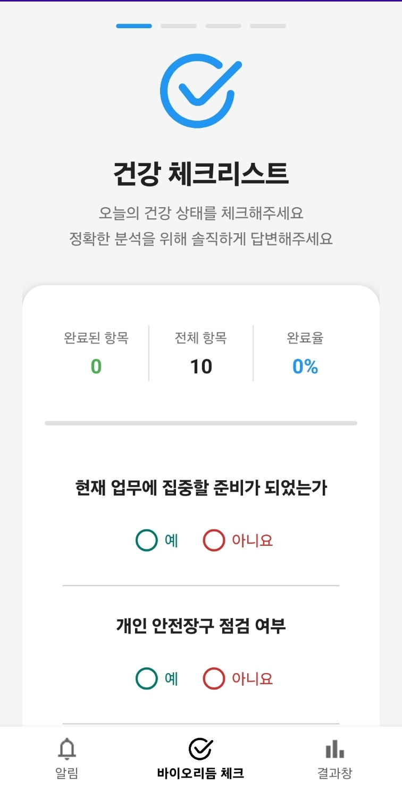
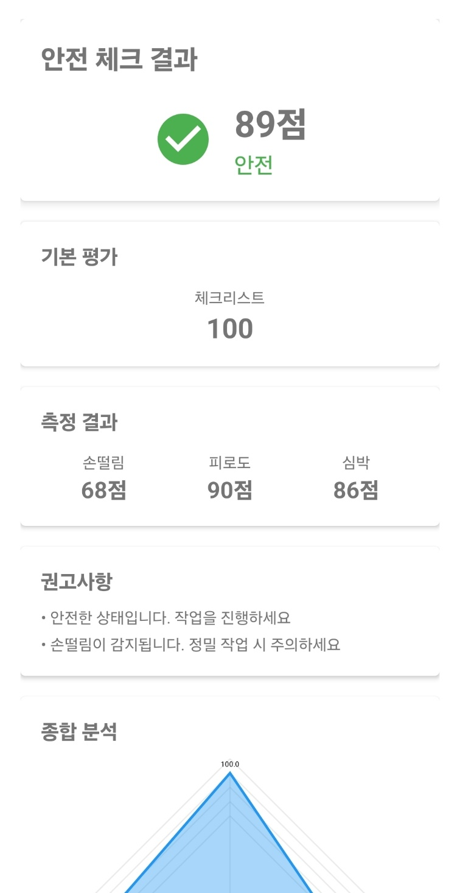
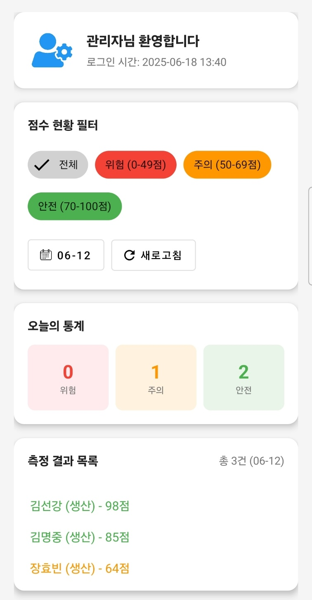

# BiMoS (Bio-signal-based Monitoring System)

**BiMoS**는 작업 시작 전 사용자의 생체신호와 신체 컨디션을 빠르게 점검해 안전 사고를 예방하도록 돕는 Android 앱입니다.  
체크리스트, 안면 인식 눈 깜빡임, 카메라‑기반 PPG, 가속도 센서를 활용한 손떨림 분석을 통합하여 피로도·주의력 저하를 감지하고, 관리자 모드로 기록을 관리합니다.

---

## 주요 기능

- **체크리스트** : 작업 전 자기보고식 안전 상태 점검  
- **PPG 측정** : 스마트폰 카메라로 심박수·HRV 분석  
- **손떨림 분석** : 가속도 FFT 계산으로 떨림 크기·주파수 산출  
- **피로도 분석** : 안면 인식 눈 깜빡임을 통한 피로도 분석  
- **알림 & 로그 기록** : 관리자모드를 통한 실시간 알림기능, Firebase에 데이터 저장  
- **관리자 모드** : 사용자별 기록 열람·필터·삭제 기능

---

## 기술 스택

| 분류 | 사용 기술 |
|------|-----------|
| **언어** | Kotlin |
| **프레임워크 / UI** | AndroidX, Jetpack Compose, Material 3 |
| **Backend-as-a-Service** | Firebase (Auth, Firestore, Realtime DB, Analytics, Cloud Messaging) |
| **센서 / 비전** | CameraX, ML Kit Face Detection |
| **차트 & 연산** | MPAndroidChart, JTransforms (FFT) |
| **DI / 비동기** | Hilt, Kotlin Coroutines, WorkManager |
| **테스트** | JUnit, AndroidX Test, Espresso |

---

## 프로젝트 구조

```bash
app/
└── src/main/
    ├── java/com.jjangdol.biorhythm/
    │   ├── data/          # Repository, Firebase 연동
    │   ├── di/            # Hilt 모듈
    │   ├── model/         # 데이터 클래스
    │   ├── ui/
    │   │   ├── checklist/
    │   │   ├── measurement/   # PPG·떨림·피로도 측정 화면
    │   │   ├── result/
    │   │   ├── admin/
    │   │   └── ...
    │   ├── util/          # 공통 유틸
    │   ├── vm/            # ViewModel
    │   ├── BioApp.kt
    │   └── MainActivity.kt
    ├── res/               # 레이아웃·이미지·values 등
    └── AndroidManifest.xml
```

---

## 설치 & 실행

1. 저장소를 클론합니다.
   ```bash
   git clone https://github.com/machoganzi/biorhythm-app.git
   cd biorhythm-app
   ```

2. Firebase 프로젝트를 생성하고 **google-services.json** 파일을 `app/` 디렉터리에 넣습니다.  
   (Auth·Firestore·Realtime DB를 활성화 후 규칙 설정)

3. Android Studio에서 프로젝트를 열고 **Run ▶️** 버튼을 눌러 기기 또는 에뮬레이터에 배포합니다.

---

## 앱 미리보기

| 메인 화면 | 분석 결과 | 관리자 화면 |             
|-------|-------|--------|
|  |  |  |

---

## 팀

| 이름 | 역할 |
|------|------|
| 김선강 | 프론트엔드 · 측정 알고리즘 |
| 장효빈 | Firebase 연동 · 관리자 기능 |
| 최영민 | UI/UX 설계 · QA |
| 전재영 | 체크리스트 시스템 · 알림 로직 |

---

## 라이선스

현재 비공개 사이드 프로젝트이며 라이선스는 추후 공개 예정입니다.  
별도 문의: <vnvndldl@naver.com>

---
